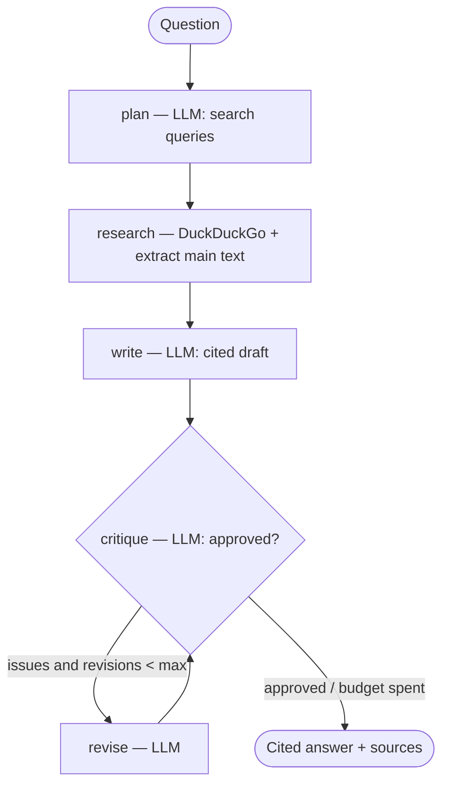

# 🔎 Research Agent — Multi-Agent Web Research (LangGraph)

Ask a question; a small team of agents **plans** web searches, **reads** the results, **writes** a
cited answer, then **critiques its own draft** and revises it — orchestrated as a **LangGraph** state
machine. Web search is **free** (DuckDuckGo, no key). Runs on **Gemini** (paste your free key) or
**fully local with Ollama**.

<!-- Add after deploying: [](YOUR_STREAMLIT_URL) -->
 

> **Demo:** run `streamlit run app.py` and add a screenshot/GIF here.

---

## Why it's interesting

- **Real multi-agent orchestration with LangGraph** — a typed state machine with distinct roles
  (planner, researcher, writer, critic, reviser), not a single mega-prompt.
- **Reflection loop** — the critic checks the draft against the sources for unsupported claims and
  missing citations, and can send it back to the reviser (**bounded to 1 revision** so it converges).
- **Grounded + cited** — answers cite the numbered sources; source text is treated as **untrusted**
  (prompt-injection defense), and the model is told to say so when the sources don't support an answer.
- **Cost is bounded by design (Rule 3)** — `3–5` LLM calls per run (plan, write, critique, +optional
  revise/critique); search/fetch use no LLM; fetched text is truncated per source. Every call is logged
  with tokens/latency/cost and the run total is shown in the UI.
- **Optional LangSmith tracing** — set `LANGSMITH_TRACING=true` + `LANGSMITH_API_KEY` and every run is
  traced in the [LangSmith](https://smith.langchain.com) UI (nodes + LLM calls, with inputs/outputs,
  latency, and token usage). Off by default — no key means it's a no-op.
- **Pinned models, dual backend** — `gemini-2.5-flash` or local `qwen3:8b`, same graph either way.

## Architecture



## Quickstart

```bash
git clone https://github.com/MohammedMaksood/research-agent.git
cd research-agent
python -m venv .venv && source .venv/bin/activate    # Windows: .venv\Scripts\activate
pip install -r requirements.txt
streamlit run app.py
```

- **Local (free):** `ollama pull qwen3:8b`, pick **Ollama (local)** in the sidebar, ask a question.
- **Gemini:** free key from [aistudio.google.com/apikey](https://aistudio.google.com/apikey) → paste in
  the sidebar (or copy `.env.example` → `.env`). Model: `gemini-2.5-flash`.

## Tests

```bash
pip install pytest && pytest -q   # offline: stubbed LLM + search, no network/API
```

## Project structure

```
research-agent/
├── app.py              # Streamlit UI (answer + sources + agent trace)
└── agent/
    ├── config.py       # pinned models, pricing, run bounds
    ├── search.py       # DuckDuckGo search + main-text extraction (no LLM)
    ├── prompts.py      # versioned planner/writer/critic/reviser prompts
    ├── llm.py          # Gemini/Ollama structured output + call logging
    ├── obs.py          # per-call cost/latency logging
    └── graph.py        # LangGraph: state, nodes, edges, reflection loop
```

## LangGraph Studio (visual debugger)

Run the agent interactively — see the graph, trigger runs, watch each node fire, and inspect/edit state:

```bash
pip install -U "langgraph-cli[inmem]"
langgraph dev --allow-blocking
```

This starts a local server on `:2024` and opens **LangGraph Studio** in your browser. `langgraph.json`
declares the graph (`agent.graph:make_graph`); `--allow-blocking` is required because the search/LLM
tools use synchronous I/O. If your browser blocks the localhost connection, add `--tunnel`.

## Deploy (free)

Push to GitHub → [share.streamlit.io](https://share.streamlit.io) → main file `app.py`. Visitors paste
their own Gemini key (no secrets in the deployment). Ollama isn't available in the cloud, so the hosted
app uses the Gemini path.

## Notes

- Models pinned June 2026 in `agent/config.py`. The local path (Ollama + DuckDuckGo) is verified
  end-to-end; the Gemini path follows the current `google-genai` SDK — bring your own key to exercise it.
- DuckDuckGo can rate-limit heavy use; the agent degrades gracefully (fewer/no sources → it says so).

## License

MIT — see [LICENSE](LICENSE).
