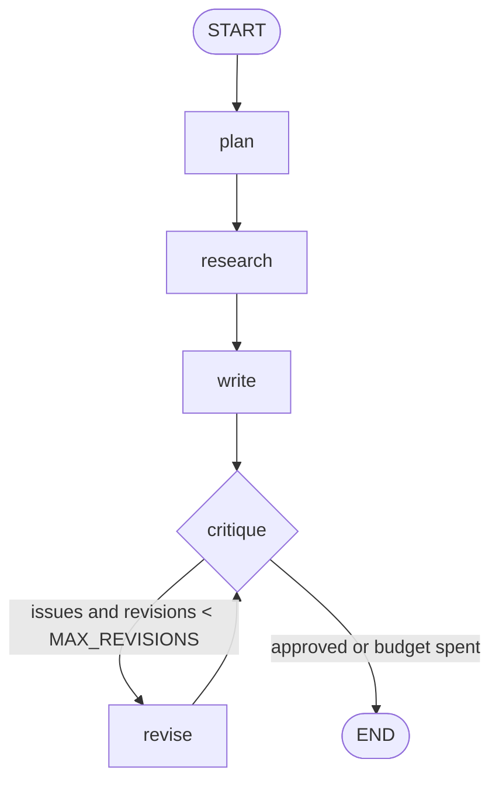
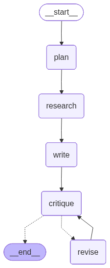

# Research Agent — Architecture & How It Works

How a question becomes a cited, self-critiqued answer. For setup and the pitch, see the
[README](../README.md).

---

## 1. What it does

A **LangGraph** state machine runs five roles in sequence, with a reflection loop:

1. **plan** — an LLM turns the question into a few focused search queries.
2. **research** — each query is run through **DuckDuckGo**; the top pages are fetched and reduced to
   their main text (no LLM here — this is the free part).
3. **write** — an LLM writes an answer grounded in the numbered sources, with inline `[n]` citations.
4. **critique** — an LLM checks the draft against the sources for unsupported claims / missing citations.
5. **revise** — if the critic found issues (and the revision budget isn't spent), the draft is rewritten
   and re-critiqued; otherwise the run ends.

Backends are interchangeable (Gemini / Ollama) — the graph doesn't change.

## 2. The graph



_Rendered from the compiled graph by LangGraph (`get_graph().draw_mermaid_png()`):_



## 3. Components

| File | Responsibility | Key API |
|------|----------------|---------|
| `agent/config.py` | Pinned models, pricing, run bounds | constants |
| `agent/search.py` | DuckDuckGo search + main-text extraction | `web_search`, `fetch_text` |
| `agent/prompts.py` | Versioned prompts per role | `*_SYS`, `PROMPT_VERSION` |
| `agent/llm.py` | Structured (schema-validated) generation + logging | `GeminiLLM`, `OllamaLLM` (`.structured`) |
| `agent/obs.py` | Per-call cost/latency record | `log_call` |
| `agent/tracing.py` | Optional LangSmith tracing (no-op without a key) | `traceable`, `tracing_enabled` |
| `agent/graph.py` | State, nodes, edges, reflection loop | `build_graph(llm)` |
| `app.py` | Streamlit UI | — |

**State** (`TypedDict`): `question, queries, sources[], answer, citations[], issues[], revisions`.
**Structured outputs** (Pydantic, validated): `Plan{queries}`, `Draft{answer, citations}`,
`Critique{approved, issues}`.

## 4. Control flow & the reflection loop

`build_graph` wires: `START → plan → research → write → critique`, then a **conditional edge**:

```
route_after_critique(state):
    if state.issues and state.revisions < MAX_REVISIONS:  return "revise"   # loop back
    else:                                                 return END
revise → critique     # the loop
```

The `revisions` counter increments on each `revise`, so the loop is **guaranteed to terminate**
(`MAX_REVISIONS = 1` by default). This is the classic *generator–critic* pattern, made explicit as graph
edges rather than hidden in a prompt.

## 5. Cost & observability (Rule 3)

LLM calls per run: `plan(1) + write(1) + critique(1)` and, if it revises once,
`+ revise(1) + critique(1)` → **3–5 calls, hard-capped**. Search and fetch use **no LLM**, and each
source's text is truncated to `SOURCE_CHARS` (4000) to bound prompt size. Every LLM call is logged to
`logs/llm_calls.jsonl` (gitignored) with node, model, tokens, latency, and USD cost; the UI shows the
run's call count and total cost.

**Optional LangSmith tracing:** with `LANGSMITH_TRACING=true` and `LANGSMITH_API_KEY` set, LangGraph's
nodes and the `@traceable`-wrapped LLM calls (`agent/tracing.py`, `agent/llm.py`) are reported to
[LangSmith](https://smith.langchain.com) as a run tree — inputs, outputs, latency, and token usage — the
production-grade view alongside the local JSONL log. Without a key it's a no-op, so the app behaves
identically.

## 6. Security

- **Prompt injection:** fetched web text is untrusted *data*. The writer/reviser prompts isolate it and
  refuse to follow instructions embedded in pages; the system role is never built from web content.
- **Secrets:** the Gemini key comes from the sidebar or `.env`, is passed only to the SDK client, and is
  never logged or placed in a prompt. `.gitignore` blocks `.env*` (only `.env.example` is committed).

## 7. Models

| Role | Cloud | Local |
|------|-------|-------|
| All LLM nodes | `gemini-2.5-flash` | `qwen3:8b` |

Pinned in `agent/config.py` (no `-latest` aliases). Gemini 2.0 Flash was retired 2026-06-01 and is unused.

## 8. Testing

`tests/test_graph.py` runs the whole graph with a **stub LLM** and **stubbed search** (monkeypatched),
so it executes the real node wiring and reflection routing with **no network and no API spend**.

## 9. Extending it

- **More tools:** add nodes (e.g. a calculator or a site-specific fetcher) and edges; the state already
  carries `sources`.
- **Deeper reflection:** raise `MAX_REVISIONS`, or add a separate fact-checker node.
- **Better search:** swap DuckDuckGo for a keyed search API behind the same `web_search` interface.
